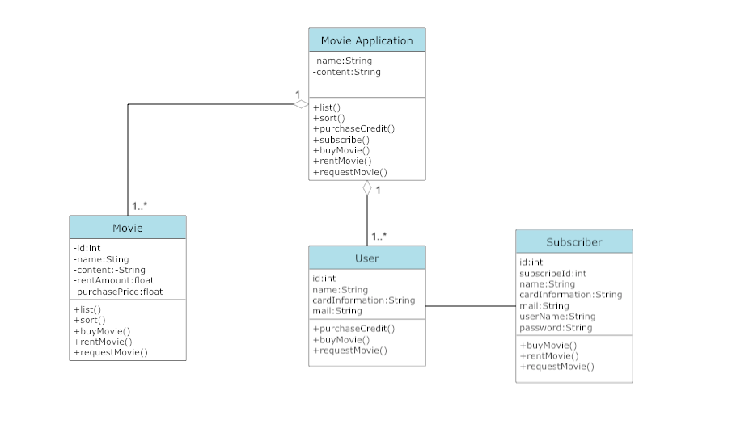

# Movie Application Management System

It is the system design of the application that sells or rents movies online.

- Movies can be listed and sorted in the app and users can subscribe to the app.
- Users purchase credits through the system for subscription.
- Only subscribed users can rent movies with their credits and the credit value of the rented movie is deducted from their accounts.
- Regular users and subscribers can purchase movies.
- If the film is not available, it can be requested.

