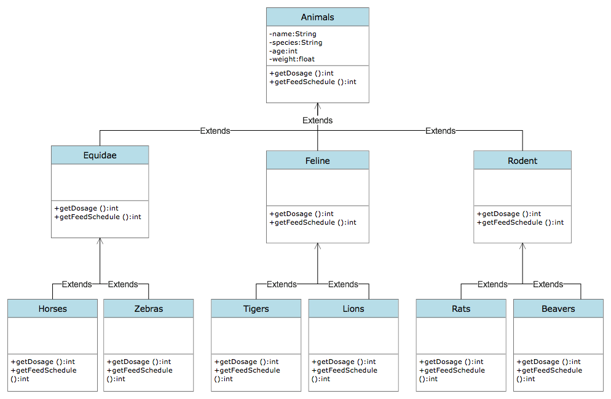

# Zoo Management System

It is a system that tracks information about animals in the zoo.

Animals are characterized by species in groups such as:

- Equidae (horses, zebras, donkeys, etc.),
- Felines (tigers, lions, etc.),
- Rodents (rats, beavers, etc.)

Much of the information stored about animals is the same for all groupings.
These are: species, name, weight, age, etc.

The system must be able to take the dosage of specific drugs for each animal.
- getDosage()

The system should also be able to calculate the Feeding times.
- getFeedSchedule()

